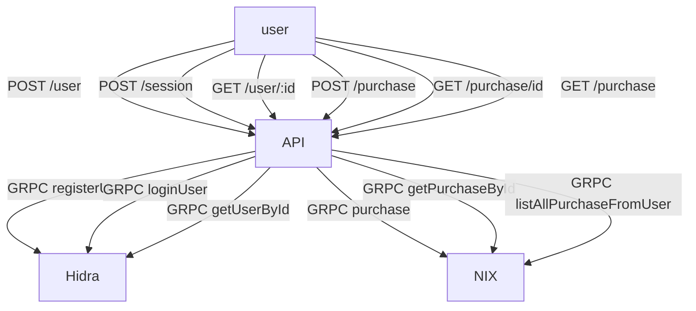

# 🛝 gRPC Playground 🛝

## 🎯 Objetivo

Criar uma estrutura simplificada, subdividida em **microserviços** baseado em suas responsabilidades usando **gRPC** para comunicação entre a API (_express_) e o microserviço.

## 👨‍💻 Tecnologias usadas

- TypeScript
- NodeJs
- Express
- MongoDB
- Docker
- gRPC

## Microserviços

### 🐝 API

Api contruida usando Typescript e express, que recebe requisiçoes HTTP, se conecta com os demais microserviços, através de gRPC.

### 🐝 Hidra

O Microseviço responsável para criacao de contas, detalhamento e login, usando JWT. O microseriviço possui toda parte lógica e comunicação com banco de dados, expondo basicamente somente as assinaturas e models para os clients.

### 🐝 Nix

O Microseviço responsável para criacao de compras de um usuário;

🔎 Os nomes dos microserviços foram baseados nos satélites naturais de Plutão. Hidra foi descoberto junto com Nix em junho de 2005.

## Subindo os microservicos

Existe um `docker-compose` onde é possivel subir todos os microserviços e ver o funcionamneto deles em conjunto.

Pode visitar cada pasta, rodar um `npm instal` e `npm run dev`, e o fim subir o banco de dados.
Para subir somente o mongodb, conheço essa imagem onde nào precisa configurar usuário.
Para fins de estudos de gRPC configuração de banco e outros detalhes, podem ficar para um outro momento,
o principal objetivo e entender o funcionamento desse outro protocolo de comuicaçao.

```shell
docker run -d --name=mongo -p 27017:27017 bitnami/mongodb
```



# Teoria

### Um pouco de história

O gRPC foi criado plo google, como open-source em 2015, como uma melhoria de uma arquitetura ja existente, o RPC
remote procedure call.Esse modelo de comunicação existe desde os anos 70.o G nao significa google, ( descobri esses dias ) ele não tem um significado único, ele altera em cada release, tem um documento no repositório que mostra todos os signficados que o g já teve, hoje por exemplo, ele significa gridman.

O grpc foi criado para ser mais performático que seu concorrente, o Rest, e utilizar uma linguagem conhecida como protocolBuffers.Dessa forma, o gRPC pode ser utilizado em diversas linguagem ao mesmo tempo, e continua sendo mais rápido e eficiante que as demais arquiteturas de chamadas de rede.

A chamada de um método remoto, no final das contas, é uma chamada local, que é transformada numa chamada de rede;

### Arquitetura

Vamos identificar 2 aprtes importantes

- SKELETON : Um decriptador de chamada, ele é o responsável, no lado do 'servidor' em pegar a chamada de rede, entender e chamar a função;
- STUB: É um objeto "falso", no lado do 'client' com todas os metodos e assinaturas que existem no server.
  ( esse nomes podem apareer de outras formas dependendo do autor... )

## É Realmente mais rápido mesmo? porque?

- Multiplexação de requests e respostas:

Pode receber varias respostas e enviar varias chamadas através de uma mesma conexão.

- Compressão de headers:

De maneira resumida, o protoclo não envia heads repetidos, após uma primeira conexão, as próximas só serão enviados os headers alterados, os outros recebem um índice para o valor anterior.

- Protocol Buffers:

( Esse pra mim é o mais legal e fácil de enxergar durante o desenvolvimento)
O JSON é muito interessante, para nós usuários, porem, quando se fala de máquina, ele ocupa muito espaço na requisição, pois são vários textos.
Imagine uma requisicao em json assim :

```json
{ "nome": "ramon", "email": "ramon@ramon.com" }
```

para o protobuff funcionar precisarimaos de um .proto assim:

```
message Exemplo {
  required string nome = 1;
 required string email = 2;
}
```

uma requisição com esse corpo seria algo asim, em binário:

` 0A 05 72 61 6D 6F 6E 12 0F 72 61 6D 6F 6E 40 72 61 6D 6F 6E 2E 63 6F 6D`

onde o **OA** é um indice, em seguida o **05** é o tamanho da string

- 72 = R
- 61 = A
- 6D = M
- 6F = O
- 6E = N

em seguida, um indice, o tamanho da próxima string, e se repete o mesmo nome, mais 2x, como no exemplo.

esse arquivo, convertido par UTF-8 fica algo como
`125ramon215ramon@ramon.com`

ocupando bem menos espaço que o json, fazendo co mque as requisiçoes se tornem mais ágeis.

Entáo ele é mais rapido e leve por usar codificação binaria;
Multiplataforma;
Já existe uma autodocumentação junto do código;
